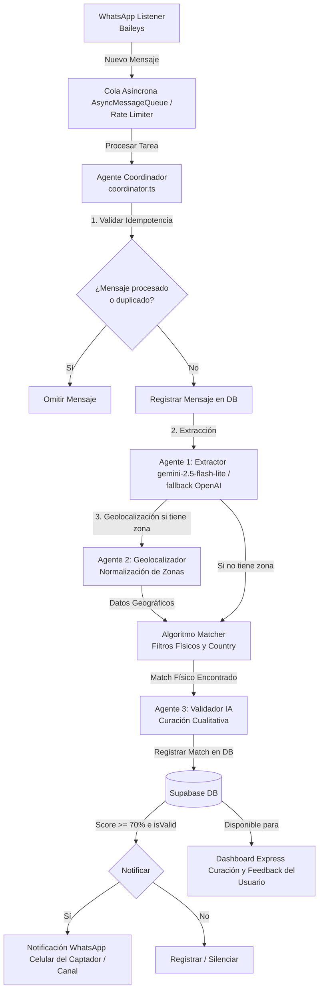

# Contexto del Proyecto: HouseMatch MVP (Actualizado)

Este documento proporciona una visión detallada de la arquitectura, componentes, flujo de datos y modelo de agentes de **HouseMatch**, reflejando la evolución desde el MVP lineal inicial hacia el sistema actual modular y orquestado.

---

## 1. Propósito del Sistema
**HouseMatch** es una herramienta automatizada diseñada para capturar pedidos de propiedades en grupos de WhatsApp de agentes inmobiliarios (Tucumán, Argentina), extraer sus intenciones y características mediante modelos de lenguaje (LLM), y cruzarlos inteligentemente con una cartera local de propiedades. Los matches calificados son notificados en tiempo real por WhatsApp y pueden ser auditados/curados desde un Dashboard interactivo.

---

## 2. Diagrama de Arquitectura y Flujo de Datos
El sistema utiliza un **Agente Coordinador** central que orquesta un pipeline asíncrono y tolerante a fallos, utilizando **Supabase (PostgreSQL)** como única fuente de verdad:

---

## 3. Arquitectura del Código y Estructura de Archivos

La aplicación está construida sobre **Node.js** y escrita en **TypeScript**. La estructura principal bajo `src` es:

*   [`src/index.ts`](file:///c:/Users/NoxiePC/Desktop/Software/housematch/src/index.ts): Punto de entrada. Inicia el cliente de WhatsApp, levanta el servidor Express del Dashboard, carga el catálogo desde la base de datos (con fallback local) y encola los mensajes entrantes en la cola asíncrona.
*   [`src/services/coordinator.ts`](file:///c:/Users/NoxiePC/Desktop/Software/housematch/src/services/coordinator.ts): **Orquestador Principal**. Implementa la lógica del `CoordinatorAgent`. Controla la idempotencia del mensaje, la deduplicación en las últimas 24 horas, la secuencia de ejecución de los sub-agentes, el almacenamiento de los matches en la base de datos y el envío de notificaciones.
*   [`src/services/gemini.ts`](file:///c:/Users/NoxiePC/Desktop/Software/housematch/src/services/gemini.ts): Implementa la lógica de IA mediante el patrón **Strategy** (`AIStrategy`). Permite alternar de forma transparente entre **Google Gemini (`gemini-2.5-flash-lite`)** y **OpenAI (`gpt-4o-mini`)** ante fallos de cuota o caídas de red. Contiene las definiciones de:
    - **Agente 1 (Extractor)**: Extrae operación, tipo de propiedad, presupuesto, moneda, dormitorios, características y restricción de countries.
    - **Agente 2 (Geolocalizador)**: Asocia la ubicación del mensaje con un ID de zona normalizado definido en el sistema.
    - **Agente 3 (Validador)**: Filtra falsos positivos analizando semánticamente si la propiedad coincide cualitativamente con el pedido (retorna un *score* y un booleano de validez).
*   [`src/services/supabase.ts`](file:///c:/Users/NoxiePC/Desktop/Software/housematch/src/services/supabase.ts): Inicialización del cliente Supabase JS SDK utilizando las credenciales del rol de servicio para interactuar con la base de datos.
*   [`src/services/whatsapp.ts`](file:///c:/Users/NoxiePC/Desktop/Software/housematch/src/services/whatsapp.ts): Gestor de conexión con la red de WhatsApp usando **Baileys**.
*   [`src/services/sheets.ts`](file:///c:/Users/NoxiePC/Desktop/Software/housematch/src/services/sheets.ts): Sincronizador de la cartera de propiedades hacia Supabase (`syncPropertiesToDatabase`).
*   [`src/services/excel.ts`](file:///c:/Users/NoxiePC/Desktop/Software/housematch/src/services/excel.ts): Parseador de archivos Excel subidos localmente a través del Dashboard.
*   [`src/utils/queue.ts`](file:///c:/Users/NoxiePC/Desktop/Software/housematch/src/utils/queue.ts): Cola de procesamiento asíncrono (`AsyncMessageQueue`) con control de flujo (*rate limiting* de 4500ms por mensaje) para proteger las llamadas a las APIs de LLM.
*   [`src/utils/matcher.ts`](file:///c:/Users/NoxiePC/Desktop/Software/housematch/src/utils/matcher.ts): Algoritmo de negocio que valida concordancia de operación, dormitorios mínimos, presupuesto (con tipo de cambio de Dólar Blue), exclusión/inclusión de countries y zonas mediante Ray-casting.
*   [`src/utils/filter.ts`](file:///c:/Users/NoxiePC/Desktop/Software/housematch/src/utils/filter.ts): Expresiones regulares rápidas para pre-filtrar mensajes que no sean solicitudes de compra o alquiler en WhatsApp.

---

## 4. Robustez, Tolerancia a Fallos e Idempotencia

1.  **Garantía de Idempotencia**:
    - **Por ID**: Cada mensaje de WhatsApp posee un ID único. El Coordinador comprueba en la tabla `Message` de Supabase si el ID ya existe antes de procesarlo.
    - **Temporal (Deduplicación)**: Si el mismo remitente envía un mensaje con idéntico contenido en un intervalo de 24 horas, el Coordinador lo descarta automáticamente para evitar spam o reprocesamientos innecesarios.
2.  **Rate Limiting y Colas**:
    - La clase `AsyncMessageQueue` serializa el procesamiento de mensajes aplicando un delay de seguridad de 4.5 segundos entre llamadas, garantizando que el sistema no exceda los límites de tasa de las APIs externas.
3.  **Fallback Dinámico de Proveedor de IA**:
    - Si la llamada a la API de Google Gemini falla por exceder la cuota (Rate Limit) o problemas de red, el sistema escala automáticamente la llamada al modelo de OpenAI (`gpt-4o-mini`) definido como estrategia de respaldo.
4.  **Saneamiento y Valores por Defecto**:
    - Las funciones de normalización en `gemini.ts` aseguran que la respuesta del LLM (aunque tenga inconsistencias) siempre se adapte a un tipo de dato esperado (`desconocido`, `indiferente`, `otro`), evitando fallos en tiempo de ejecución.

---

## 5. Panel de Control y Retroalimentación (Feedback Loop)

El sistema incluye una interfaz web (Dashboard Express) que conecta directamente con la base de datos de Supabase para ofrecer las siguientes funcionalidades:
- **Carga de Catálogo**: Subida de archivos Excel y sincronización inmediata a la base de datos PostgreSQL.
- **Auditoría de Matches**: Visualización en tiempo real de los matches generados por el Coordinador, mostrando tanto el texto original del chat como los detalles físicos y el razonamiento del Agente Validador.
- **Curación y Cierre de Loop**: Permite al usuario aprobar (`ACCEPTED`) o rechazar (`REJECTED` indicando un motivo) los matches desde el panel, lo cual actualiza el estado en Supabase para el registro histórico y la mejora futura de los prompts de los agentes.
