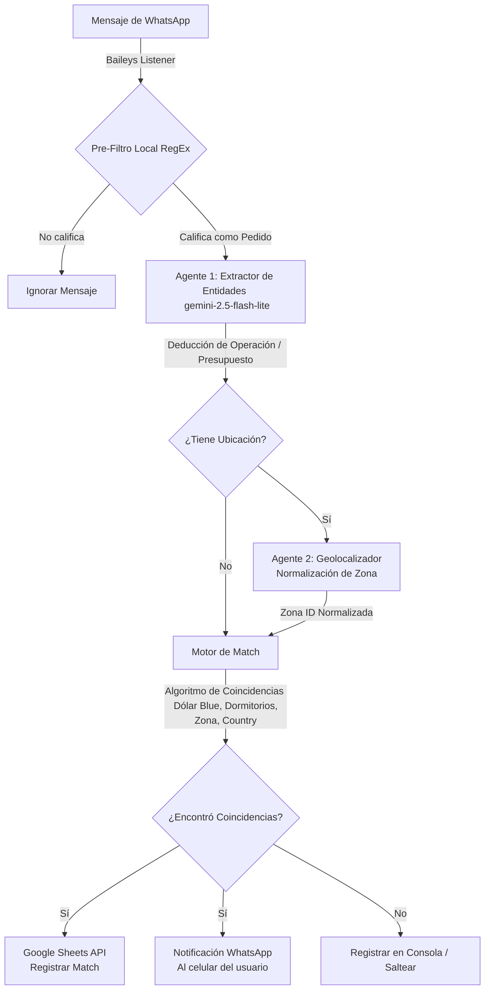

# Contexto del Proyecto: HouseMatch MVP

Este documento proporciona una visión detallada y funcional de la estructura, arquitectura, flujos y tecnologías utilizadas en el MVP de **HouseMatch**.

---

## 1. Propósito del Sistema
**HouseMatch** es una herramienta automatizada diseñada para capturar pedidos de propiedades en grupos de WhatsApp de agentes inmobiliarios (Tucumán, Argentina), extraer sus intenciones y características de forma estructurada mediante modelos de lenguaje (LLM), y cruzarlos automáticamente con una cartera local de propiedades para notificar coincidencias (matches) de manera inmediata.

---

## 2. Diagrama de Flujo Funcional
El procesamiento de un mensaje entrante sigue un pipeline lineal y desacoplado:

---

## 3. Arquitectura del Código y Estructura de Archivos

El código está escrito en **TypeScript** y corre sobre **Node.js**. La estructura del directorio principal bajo `src` es:

*   [`src/index.ts`](file:///c:/Users/NoxiePC/Desktop/Software/housematch/src/index.ts): Punto de entrada del servidor. Orquesta el cliente de WhatsApp, levanta el servidor Express del Dashboard y define la lógica del pipeline de procesamiento (`processIncomingMessage`).
*   [`src/services/whatsapp.ts`](file:///c:/Users/NoxiePC/Desktop/Software/housematch/src/services/whatsapp.ts): Gestor de conexión con WhatsApp utilizando la biblioteca **Baileys**. Controla la autenticación, re-conexión automática, generación de códigos QR y lectura/escritura de notificaciones.
*   [`src/services/gemini.ts`](file:///c:/Users/NoxiePC/Desktop/Software/housematch/src/services/gemini.ts): Implementa el patrón **Strategy** para la integración de Inteligencia Artificial. Maneja los prompts del Agente 1 (Extracción) y Agente 2 (Geolocalización), con soporte para **Google Gemini** y un fallback dinámico hacia **OpenAI**.
*   [`src/services/sheets.ts`](file:///c:/Users/NoxiePC/Desktop/Software/housematch/src/services/sheets.ts): Adaptador para sincronizar la base de datos de Excel en la nube usando Google Sheets API. Permite leer la cartera de propiedades y registrar de forma persistente los matches generados.
*   [`src/services/excel.ts`](file:///c:/Users/NoxiePC/Desktop/Software/housematch/src/services/excel.ts): Permite procesar archivos Excel subidos localmente a través del Dashboard y guardarlos en caché del servidor (`catalog.json`).
*   [`src/utils/matcher.ts`](file:///c:/Users/NoxiePC/Desktop/Software/housematch/src/utils/matcher.ts): Algoritmo puro de negocio. Compara los campos del pedido (LLM) con las propiedades de la cartera. Resuelve la geolocalización basada en coordenadas espaciales (Polígonos Ray-casting) y filtra estrictamente por operación, tipo de propiedad, dormitorios, precios (con conversión Dólar Blue) y exclusión/inclusión de **countries** (barrios cerrados).
*   [`src/utils/filter.ts`](file:///c:/Users/NoxiePC/Desktop/Software/housematch/src/utils/filter.ts): Filtro estático ultrarrápido basado en patrones Regex para clasificar si un texto entrante es una demanda (pedido comercial) y descartar ofertas o mensajes casuales sin gastar recursos de API.
*   [`src/utils/constants/zones.ts`](file:///c:/Users/NoxiePC/Desktop/Software/housematch/src/utils/constants/zones.ts): Coordenadas y límites geográficos de las zonas del mercado inmobiliario (Tucumán).
*   [`src/test-pipeline.ts`](file:///c:/Users/NoxiePC/Desktop/Software/housematch/src/test-pipeline.ts): Script ejecutable de simulación (*dry-run*) para probar la lógica completa sin consumir conexiones de WhatsApp reales.

---

## 4. Gestión de Errores y Tolerancia a Fallos

El sistema fue diseñado teniendo en cuenta la inestabilidad de las redes e interfaces de terceros:

1.  **Resiliencia del Proceso (`process.on`)**:
    En [`src/index.ts`](file:///c:/Users/NoxiePC/Desktop/Software/housematch/src/index.ts) se capturan los eventos `unhandledRejection` y `uncaughtException`. Esto previene que fallos internos en las conexiones websocket de Baileys o llamadas a APIs derrumben el servidor NodeJS.
2.  **Fallback de IA (OpenAI / Gemini)**:
    Si la API de Google Gemini excede su cuota de llamadas o falla por red, el administrador de estrategias (`AIExtractorContext` en `gemini.ts`) cambia de forma transparente a **OpenAI (gpt-4o-mini)** para no interrumpir el flujo.
3.  **Normalización Seguro de Datos**:
    Las funciones `normalizeAgent1` y `normalizeAgent2` aseguran que aunque la IA devuelva estructuras inconsistentes o nulas, estas sean saneadas a valores válidos por defecto (`indiferente`, `otro`, `desconocido`), evitando excepciones de tipo `undefined` en el comparador.
4.  **WhatsApp Connection Recovery**:
    El servicio de WhatsApp monitorea de forma proactiva la desconexión del socket (código 408 u otros) y limpia periódicamente referencias corruptas antes de intentar un reinicio en bucle.

---

## 5. APIs y Librerías Utilizadas

*   **`@google/genai`**: Cliente SDK para conectarse a Google Gemini. Se usa el modelo súper rápido y de bajo costo `gemini-2.5-flash-lite` con esquemas JSON estructurados estrictos.
*   **`@whiskeysockets/baileys`**: API liviana y de bajo nivel para interactuar con la red de WhatsApp simulando la app móvil, ideal para despliegues ligeros sin depender de navegadores pesados como Puppeteer/Chromium.
*   **`googleapis`**: Utilizada para acceder de forma segura mediante *Service Account* a las hojas de cálculo compartidas en Google Sheets.
*   **`express`**: Servidor Web para disponibilizar la API REST y servir la interfaz interactiva del Dashboard.
*   **`xlsx` (SheetJS)**: Procesador eficiente en memoria para parsear archivos binarios `.xlsx` cargados por el usuario.
